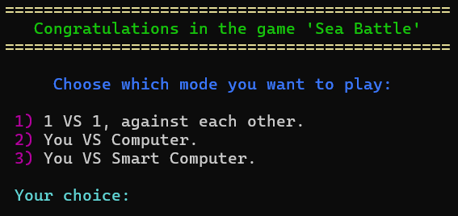

# Sea Battle
My semester project in C++

Description:
A classic implementation of the "Battleship" game with three game modes:

1) Player vs Player (1v1):
Two players compete against each other on the same keyboard. Each player places their ships and takes turns attacking the opponent's field (in the development process).

2) Player vs Computer:
A simpler version of artificial intelligence. The computer randomly places ships and fires shots at random.

3) Player vs "Smart" Computer:
An improved AI logic. After a successful hit, the computer continues searching adjacent cells, simulating a logical strategy for locating ships (in the development process).

---------------------------------------------------------------------------------------------------------------------------------------------------

Implemented Features:
  -> A 10x10 game board.
  -> Visual representation of the board in the console (ASCII).
  -> Coordinate input and data validation.
  -> Separate classes or functions for:
  -> Ship placement
  -> Hit detection
  -> Random coordinate generation
  -> AI logic
  -> Game result output, including shot count and winner determination.

---------------------------------------------------------------------------------------------------------------------------------------------------

What I Learned:
  -> Working with two-dimensional arrays.
  -> Basics of structured programming.
  -> Organizing a game into stages: initialization, setup, gameplay, and ending.
  -> Basic artificial intelligence logic.
  -> Separating logic into individual modules/functions for easier code maintenance.

---------------------------------------------------------------------------------------------------------------------------------------------------
Game interface:

